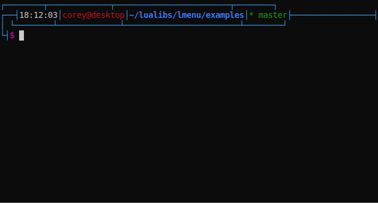
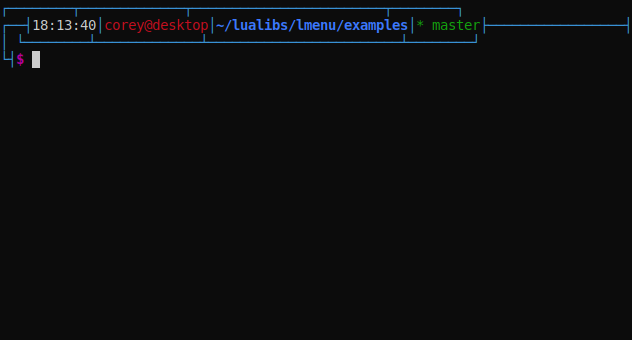

# lmenu
A simple library for creating command line menus, inspired by inquirer.js.




# Dependencies
 - \>= Lua 5.1
 - lgetchar\*

\* This uses my [lgetchar](https://github.com/3uclidian/lgetchar) library, (which is cobbled together and as it says on its own repo I have no idea how portable it is) to allow for arrow keys and such to be recognized

# Usage
Create a menu object, add options to it with callbacks, then call the menu

```lua
local lmenu = require "lmenu"
local m = lmenu.list()
m:setSelector("->")
m:add("This is an option")
m:add("Option 2")
m:add(":)")
m()
```
Or for convenience, each function will return the menu object so you can chain them together like so:
```lua
local m = lmenu.list()
	:setSelector("->")
	:add("This is an option")
	:add("Option 2")
	:add(":)")
	()
```

Which should produce the following menu, controlled by the arrow keys (or j and k for vim users) and enter
```
->This is an option
  Option 2
  :)
```

----
More examples can be found in the examples directory of this repository and in the project and update scripts in my [utils repository](https://github.com/3uclidian/utils)


